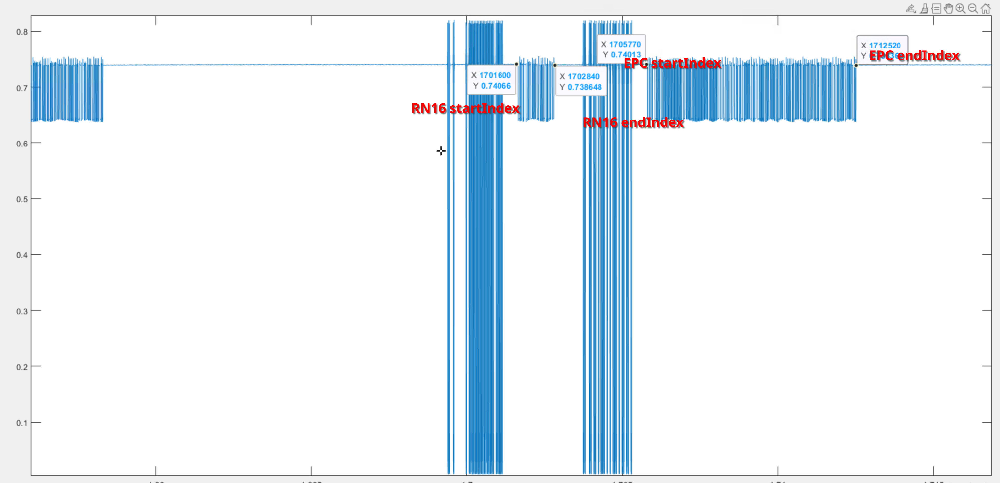

# differentFrePhaseAndAmp_allFile

This code is used for processing the data collected from ReproduceRFIDUsrpOutdoor. The data is collected from the USRP device and contains information about the phase and amplitude of different frequencies. The code processes this data to extract relevant information and save it in a structured format.
The processed data is then used for further analysis and visualization with Reproduce_RF_EASTS.

## How to use the code

The data folders are organized as follows:

```plaintext
|-- data
    |-- objects_1
        |-- frequency_1
            |-- outband_source
            |-- source
        |-- frequency_2
        |-- ...
        |-- frequency_n
    |-- objects_2
        |-- frequency_1
            |-- outband_source
            |-- source
        |-- frequency_2
        |-- ...
        |-- frequency_n
    |-- ...
    |-- objects_n
        |-- frequency_1
            |-- outband_source
            |-- source
        |-- frequency_2
        |-- ...
        |-- frequency_n
```

* Change ***path1*** to filepath of any source file(such as ./data/objects_1/frequency_1/source);
* Change ***path2*** to floder path of data;
* Change ***index1*** and ***index2*** to the ***start*** or ***end*** index of any EPC or RN16 waveform in the source file above (such as below)

  

## Result

The processed data is organized as follows:

```plaintext
|-- data
|-- objects_1.txt
|-- objects_2.txt
|-- ...
|-- objects_n.txt
```

Then the data can be used for further analysis and visualization with Reproduce_RF_EASTS.
